Cyclistic Bike Share Data Analysis
================
Jimi Adeleke
2023-09-30

## **Google Data Analytics Capstone Project: How Does a Bike-Share Navigate Speedy Success?**

### Introduction

The Google Professional Data Analytics Certification includes the
Cyclistic case study. In this case study, I am a junior data analyst at
Cyclistic. I will follow basic data analysis process steps to solve core
business problems.

I’m a junior data analyst on the marketing analyst team at Cyclistic, a
Chicago-based bike-sharing firm. The marketing manager believes that
increasing annual memberships will be critical to the company’s future
success. As a member of the marketing team, he aims to discover how
cyclistic bikes are used differently depending on membership type. My
role here will be to study and analyze 12 months of data, extract
insights from it using various visualizations, and present it to the
team. I evaluated very precise data and attempted to substantiate these
findings with clear graphs so that my proposals may be considered.In
this case study, I used data from a fictional bike rental company based
in Chicago, Cyclist, to try to determine and understand the main
differences between annual members and casual rider. With such insights,
I was able to deliver recommendations, with which the company has
developed a marketing campaign aimed at converting casual riders to
annual members, and hence maximizing the growth of the company.

I obtained the datasets from the link provided below.

Cyclistic travel data for 2022 is available at
<https://divvy-tripdata.s3.amazonaws.com/index.html>.

## Setting up the environment

Here, I use several libraries that help reading, cleaning, organizing
and analyzing the data.

#### Importing data

Cyclist data from 01/2022 until 12/2022 is imported and read as csv.
files.

``` r
data_1 <- read.csv("C:/Users/USER/Desktop/PORTFOLIO PROJECT/R/Google data analysis capstone (bike share analysis)/Datasets/202201-divvy-tripdata.csv")
data_2 <- read.csv("C:/Users/USER/Desktop/PORTFOLIO PROJECT/R/Google data analysis capstone (bike share analysis)/Datasets/202202-divvy-tripdata.csv")
data_3 <- read.csv("C:/Users/USER/Desktop/PORTFOLIO PROJECT/R/Google data analysis capstone (bike share analysis)/Datasets/202203-divvy-tripdata.csv")
data_4 <- read.csv("C:/Users/USER/Desktop/PORTFOLIO PROJECT/R/Google data analysis capstone (bike share analysis)/Datasets/202204-divvy-tripdata.csv")
data_5 <- read.csv("C:/Users/USER/Desktop/PORTFOLIO PROJECT/R/Google data analysis capstone (bike share analysis)/Datasets/202205-divvy-tripdata.csv")
data_6 <- read.csv("C:/Users/USER/Desktop/PORTFOLIO PROJECT/R/Google data analysis capstone (bike share analysis)/Datasets/202206-divvy-tripdata.csv")
data_7 <- read.csv("C:/Users/USER/Desktop/PORTFOLIO PROJECT/R/Google data analysis capstone (bike share analysis)/Datasets/202207-divvy-tripdata.csv")
data_8 <- read.csv("C:/Users/USER/Desktop/PORTFOLIO PROJECT/R/Google data analysis capstone (bike share analysis)/Datasets/202208-divvy-tripdata.csv")
data_9 <- read.csv("C:/Users/USER/Desktop/PORTFOLIO PROJECT/R/Google data analysis capstone (bike share analysis)/Datasets/202209-divvy-tripdata.csv")
data_10 <- read.csv("C:/Users/USER/Desktop/PORTFOLIO PROJECT/R/Google data analysis capstone (bike share analysis)/Datasets/202210-divvy-tripdata.csv")
data_11 <- read.csv("C:/Users/USER/Desktop/PORTFOLIO PROJECT/R/Google data analysis capstone (bike share analysis)/Datasets/202211-divvy-tripdata.csv")
data_12 <- read.csv("C:/Users/USER/Desktop/PORTFOLIO PROJECT/R/Google data analysis capstone (bike share analysis)/Datasets/202212-divvy-tripdata.csv")
```

## checking datasets columns

Compare column names each of the files. While the names don’t have to be
in the same order, they DO need to match perfectly before they are
joined into one file.

``` r
colnames(data_1)
```

    ##  [1] "ride_id"            "rideable_type"      "started_at"        
    ##  [4] "ended_at"           "start_station_name" "start_station_id"  
    ##  [7] "end_station_name"   "end_station_id"     "start_lat"         
    ## [10] "start_lng"          "end_lat"            "end_lng"           
    ## [13] "member_casual"

``` r
colnames(data_2)
```

    ##  [1] "ride_id"            "rideable_type"      "started_at"        
    ##  [4] "ended_at"           "start_station_name" "start_station_id"  
    ##  [7] "end_station_name"   "end_station_id"     "start_lat"         
    ## [10] "start_lng"          "end_lat"            "end_lng"           
    ## [13] "member_casual"

``` r
colnames(data_3)
```

    ##  [1] "ride_id"            "rideable_type"      "started_at"        
    ##  [4] "ended_at"           "start_station_name" "start_station_id"  
    ##  [7] "end_station_name"   "end_station_id"     "start_lat"         
    ## [10] "start_lng"          "end_lat"            "end_lng"           
    ## [13] "member_casual"

``` r
colnames(data_4)
```

    ##  [1] "ride_id"            "rideable_type"      "started_at"        
    ##  [4] "ended_at"           "start_station_name" "start_station_id"  
    ##  [7] "end_station_name"   "end_station_id"     "start_lat"         
    ## [10] "start_lng"          "end_lat"            "end_lng"           
    ## [13] "member_casual"

``` r
colnames(data_5)
```

    ##  [1] "ride_id"            "rideable_type"      "started_at"        
    ##  [4] "ended_at"           "start_station_name" "start_station_id"  
    ##  [7] "end_station_name"   "end_station_id"     "start_lat"         
    ## [10] "start_lng"          "end_lat"            "end_lng"           
    ## [13] "member_casual"

``` r
colnames(data_6)
```

    ##  [1] "ride_id"            "rideable_type"      "started_at"        
    ##  [4] "ended_at"           "start_station_name" "start_station_id"  
    ##  [7] "end_station_name"   "end_station_id"     "start_lat"         
    ## [10] "start_lng"          "end_lat"            "end_lng"           
    ## [13] "member_casual"

``` r
colnames(data_7)
```

    ##  [1] "ride_id"            "rideable_type"      "started_at"        
    ##  [4] "ended_at"           "start_station_name" "start_station_id"  
    ##  [7] "end_station_name"   "end_station_id"     "start_lat"         
    ## [10] "start_lng"          "end_lat"            "end_lng"           
    ## [13] "member_casual"

``` r
colnames(data_8)
```

    ##  [1] "ride_id"            "rideable_type"      "started_at"        
    ##  [4] "ended_at"           "start_station_name" "start_station_id"  
    ##  [7] "end_station_name"   "end_station_id"     "start_lat"         
    ## [10] "start_lng"          "end_lat"            "end_lng"           
    ## [13] "member_casual"

``` r
colnames(data_9)
```

    ##  [1] "ride_id"            "rideable_type"      "started_at"        
    ##  [4] "ended_at"           "start_station_name" "start_station_id"  
    ##  [7] "end_station_name"   "end_station_id"     "start_lat"         
    ## [10] "start_lng"          "end_lat"            "end_lng"           
    ## [13] "member_casual"

``` r
colnames(data_10)
```

    ##  [1] "ride_id"            "rideable_type"      "started_at"        
    ##  [4] "ended_at"           "start_station_name" "start_station_id"  
    ##  [7] "end_station_name"   "end_station_id"     "start_lat"         
    ## [10] "start_lng"          "end_lat"            "end_lng"           
    ## [13] "member_casual"

``` r
colnames(data_11)
```

    ##  [1] "ride_id"            "rideable_type"      "started_at"        
    ##  [4] "ended_at"           "start_station_name" "start_station_id"  
    ##  [7] "end_station_name"   "end_station_id"     "start_lat"         
    ## [10] "start_lng"          "end_lat"            "end_lng"           
    ## [13] "member_casual"

``` r
colnames(data_12)
```

    ##  [1] "ride_id"            "rideable_type"      "started_at"        
    ##  [4] "ended_at"           "start_station_name" "start_station_id"  
    ##  [7] "end_station_name"   "end_station_id"     "start_lat"         
    ## [10] "start_lng"          "end_lat"            "end_lng"           
    ## [13] "member_casual"

## combining all datasets into 1

the 12 data sets are combined into one big data frame of 5667717
observations and 13 columns

``` r
full_year <- rbind(data_1,data_2,data_3,data_4,data_5,data_6,data_7,data_8,
                   data_9,data_10,data_11,data_12)
dim(full_year)
```

    ## [1] 5667717      13

## Clean up and organize data to prepare for analysis

Inspect the new table that has been created.

#### see the first 6 rows

``` r
head(full_year) 
```

    ##            ride_id rideable_type          started_at            ended_at
    ## 1 C2F7DD78E82EC875 electric_bike 2022-01-13 11:59:47 2022-01-13 12:02:44
    ## 2 A6CF8980A652D272 electric_bike 2022-01-10 08:41:56 2022-01-10 08:46:17
    ## 3 BD0F91DFF741C66D  classic_bike 2022-01-25 04:53:40 2022-01-25 04:58:01
    ## 4 CBB80ED419105406  classic_bike 2022-01-04 00:18:04 2022-01-04 00:33:00
    ## 5 DDC963BFDDA51EEA  classic_bike 2022-01-20 01:31:10 2022-01-20 01:37:12
    ## 6 A39C6F6CC0586C0B  classic_bike 2022-01-11 18:48:09 2022-01-11 18:51:31
    ##              start_station_name start_station_id              end_station_name
    ## 1      Glenwood Ave & Touhy Ave              525          Clark St & Touhy Ave
    ## 2      Glenwood Ave & Touhy Ave              525          Clark St & Touhy Ave
    ## 3 Sheffield Ave & Fullerton Ave     TA1306000016 Greenview Ave & Fullerton Ave
    ## 4      Clark St & Bryn Mawr Ave     KA1504000151     Paulina St & Montrose Ave
    ## 5   Michigan Ave & Jackson Blvd     TA1309000002        State St & Randolph St
    ## 6         Wood St & Chicago Ave              637       Honore St & Division St
    ##   end_station_id start_lat start_lng  end_lat   end_lng member_casual
    ## 1         RP-007  42.01280 -87.66591 42.01256 -87.67437        casual
    ## 2         RP-007  42.01276 -87.66597 42.01256 -87.67437        casual
    ## 3   TA1307000001  41.92560 -87.65371 41.92533 -87.66580        member
    ## 4   TA1309000021  41.98359 -87.66915 41.96151 -87.67139        casual
    ## 5   TA1305000029  41.87785 -87.62408 41.88462 -87.62783        member
    ## 6   TA1305000034  41.89563 -87.67207 41.90312 -87.67394        member

#### List of column names

``` r
colnames(full_year) 
```

    ##  [1] "ride_id"            "rideable_type"      "started_at"        
    ##  [4] "ended_at"           "start_station_name" "start_station_id"  
    ##  [7] "end_station_name"   "end_station_id"     "start_lat"         
    ## [10] "start_lng"          "end_lat"            "end_lng"           
    ## [13] "member_casual"

#### list of columns and data types (numeric, character, etc)

``` r
str(full_year) 
```

    ## 'data.frame':    5667717 obs. of  13 variables:
    ##  $ ride_id           : chr  "C2F7DD78E82EC875" "A6CF8980A652D272" "BD0F91DFF741C66D" "CBB80ED419105406" ...
    ##  $ rideable_type     : chr  "electric_bike" "electric_bike" "classic_bike" "classic_bike" ...
    ##  $ started_at        : chr  "2022-01-13 11:59:47" "2022-01-10 08:41:56" "2022-01-25 04:53:40" "2022-01-04 00:18:04" ...
    ##  $ ended_at          : chr  "2022-01-13 12:02:44" "2022-01-10 08:46:17" "2022-01-25 04:58:01" "2022-01-04 00:33:00" ...
    ##  $ start_station_name: chr  "Glenwood Ave & Touhy Ave" "Glenwood Ave & Touhy Ave" "Sheffield Ave & Fullerton Ave" "Clark St & Bryn Mawr Ave" ...
    ##  $ start_station_id  : chr  "525" "525" "TA1306000016" "KA1504000151" ...
    ##  $ end_station_name  : chr  "Clark St & Touhy Ave" "Clark St & Touhy Ave" "Greenview Ave & Fullerton Ave" "Paulina St & Montrose Ave" ...
    ##  $ end_station_id    : chr  "RP-007" "RP-007" "TA1307000001" "TA1309000021" ...
    ##  $ start_lat         : num  42 42 41.9 42 41.9 ...
    ##  $ start_lng         : num  -87.7 -87.7 -87.7 -87.7 -87.6 ...
    ##  $ end_lat           : num  42 42 41.9 42 41.9 ...
    ##  $ end_lng           : num  -87.7 -87.7 -87.7 -87.7 -87.6 ...
    ##  $ member_casual     : chr  "casual" "casual" "member" "casual" ...

#### create columns for: day of week, month, day, year, time, hour

days of the week are assigned the numbers 1:Monday, 2:Tuesday, etc. This
will allow the aggregation of the data by each day, month or
day_of_week.

``` r
full_year$date <- as.Date(full_year$started_at) #The default format is yyyy-mm-dd
full_year$year <- format(as.Date(full_year$date),'%Y') #extracting year from date
full_year$month <- format(as.Date(full_year$date),'%m') #extracting month from date
full_year$day <- format(as.Date(full_year$date),'%d') #extracting day from date
full_year$num_of_day <- format(as.Date(full_year$date),'%u') #extracting num_of_week from date
full_year$day_of_week <- format(as.Date(full_year$date),'%A') #extracting day_of_week from date
#full_year$time <- format(as.Date(full_year$started_at), "%H:%M:%S") #format time as HH:MM:SS
full_year$time <- format(as.POSIXct(full_year$started_at), format = "%H:%M:%S")
#full_year$hour <- format(as.POSIXct(full_year$started_at), format = "%H") #extracting hour from time
```

#### extracting hour from time

``` r
full_year$hour <- hour(full_year$started_at)
```

#### create column for different seasons: Spring, Summer, Fall, Winter

``` r
# full_year$season <- season(full_year$month) (use to assign season to month)
full_year <- full_year %>%
  mutate(season = 
           case_when(month == "03" ~ "Spring",
                     month == "04" ~ "Spring",
                     month == "05" ~ "Spring",
                     month == "06"  ~ "Summer",
                     month == "07"  ~ "Summer",
                     month == "08"  ~ "Summer",
                     month == "09" ~ "Fall",
                     month == "10" ~ "Fall",
                     month == "11" ~ "Fall",
                     month == "12" ~ "Winter",
                     month == "01" ~ "Winter",
                     month == "02" ~ "Winter"))
```

#### create column for different time_of_day: Night, Morning, Afternoon, Evening

``` r
full_year <- full_year %>%
  mutate(time_of_day =
           case_when( hour == "00" ~ "Night",
                      hour == "01" ~ "Night",
                      hour == "02" ~ "Night",
                      hour == "03" ~ "Night",
                      hour == "04" ~ "Night",
                      hour == "05" ~ "Night",
                      hour == "06" ~ "Morning",
                      hour == "07" ~ "Morning",
                      hour == "08" ~ "Morning",
                      hour == "09" ~ "Morning",
                      hour == "10" ~ "Morning",
                      hour == "11" ~ "Morning",
                      hour == "12" ~ "Afternoon",
                      hour == "13" ~ "Afternoon",
                      hour == "14" ~ "Afternoon",
                      hour == "15" ~ "Afternoon",
                      hour == "16" ~ "Afternoon",
                      hour == "17" ~ "Afternoon",
                      hour == "18" ~ "Evening",
                      hour == "19" ~ "Evening",
                      hour == "20" ~ "Evening",
                      hour == "21" ~ "Evening",
                      hour == "22" ~ "Evening",
                      hour == "23" ~ "Evening"))
```

#### create a column for the month using the full month name

``` r
full_year <- full_year %>%
  mutate(month_name = 
           case_when( month == "01" ~ "January",
                      month == "02" ~ "February",
                      month == "03" ~ "March",
                      month == "04" ~ "April",
                      month == "05" ~ "May",
                      month == "06" ~ "June",
                      month == "07" ~ "July",
                      month == "08" ~ "August",
                      month == "09" ~ "September",
                      month == "10" ~ "October",
                      month == "11" ~ "November",
                      month == "12" ~ "December"))
```

#### calculate ride length by subtracting ended_at time from started_at time and converted it to minutes

``` r
full_year$ride_length <- difftime(full_year$ended_at, full_year$started_at, units='mins')
full_year$ride_length <- round(full_year$ride_length, digits =1)
```

#### Convert c(ride_length, ride_length_m, day and month) to numeric so that calculation can be executed.

``` r
full_year$ride_length <- as.numeric(as.character(full_year$ride_length))
#all_trips$ride_length_m <- as.numeric(as.character(all_trips$ride_length_m))
full_year$month <- as.numeric(full_year$month)
full_year$day <- as.numeric(full_year$day)
is.numeric(full_year$ride_length)
```

    ## [1] TRUE

``` r
#is.numeric(full_year$ride_length_m)
is.numeric(full_year$month)
```

    ## [1] TRUE

``` r
is.numeric(full_year$day)
```

    ## [1] TRUE

#### checking the dtypes of each column

``` r
str(full_year)
```

    ## 'data.frame':    5667717 obs. of  25 variables:
    ##  $ ride_id           : chr  "C2F7DD78E82EC875" "A6CF8980A652D272" "BD0F91DFF741C66D" "CBB80ED419105406" ...
    ##  $ rideable_type     : chr  "electric_bike" "electric_bike" "classic_bike" "classic_bike" ...
    ##  $ started_at        : chr  "2022-01-13 11:59:47" "2022-01-10 08:41:56" "2022-01-25 04:53:40" "2022-01-04 00:18:04" ...
    ##  $ ended_at          : chr  "2022-01-13 12:02:44" "2022-01-10 08:46:17" "2022-01-25 04:58:01" "2022-01-04 00:33:00" ...
    ##  $ start_station_name: chr  "Glenwood Ave & Touhy Ave" "Glenwood Ave & Touhy Ave" "Sheffield Ave & Fullerton Ave" "Clark St & Bryn Mawr Ave" ...
    ##  $ start_station_id  : chr  "525" "525" "TA1306000016" "KA1504000151" ...
    ##  $ end_station_name  : chr  "Clark St & Touhy Ave" "Clark St & Touhy Ave" "Greenview Ave & Fullerton Ave" "Paulina St & Montrose Ave" ...
    ##  $ end_station_id    : chr  "RP-007" "RP-007" "TA1307000001" "TA1309000021" ...
    ##  $ start_lat         : num  42 42 41.9 42 41.9 ...
    ##  $ start_lng         : num  -87.7 -87.7 -87.7 -87.7 -87.6 ...
    ##  $ end_lat           : num  42 42 41.9 42 41.9 ...
    ##  $ end_lng           : num  -87.7 -87.7 -87.7 -87.7 -87.6 ...
    ##  $ member_casual     : chr  "casual" "casual" "member" "casual" ...
    ##  $ date              : Date, format: "2022-01-13" "2022-01-10" ...
    ##  $ year              : chr  "2022" "2022" "2022" "2022" ...
    ##  $ month             : num  1 1 1 1 1 1 1 1 1 1 ...
    ##  $ day               : num  13 10 25 4 20 11 30 22 17 28 ...
    ##  $ num_of_day        : chr  "4" "1" "2" "2" ...
    ##  $ day_of_week       : chr  "Thursday" "Monday" "Tuesday" "Tuesday" ...
    ##  $ time              : chr  "11:59:47" "08:41:56" "04:53:40" "00:18:04" ...
    ##  $ hour              : int  11 8 4 0 1 18 18 12 7 15 ...
    ##  $ season            : chr  "Winter" "Winter" "Winter" "Winter" ...
    ##  $ time_of_day       : chr  "Morning" NA NA NA ...
    ##  $ month_name        : chr  "January" "January" "January" "January" ...
    ##  $ ride_length       : num  3 4.3 4.3 14.9 6 3.4 16.6 12.1 25.4 7.4 ...

#### checking ride_length column if there is negative number

``` r
#full_year %>%
  #filter(ride_length < 0)
```

#### remove negative number from ride_length column

``` r
full_year <- full_year[!(full_year$ride_length <= 0),]
```

#### removing rows with NA

``` r
full_year <- na.omit(full_year)
```

#### remove duplicate rows

``` r
full_year <- distinct(full_year)
```

#### remove columns not needed:ride_id, start_station_id, end_station_id, start_lat, start_lng,end_lat,end_lng

``` r
full_year <- full_year %>%
  select(-c(ride_id, start_station_id, end_station_id, start_lat, start_lng,end_lat,end_lng))
```

#### checking the num of obs and variables of the cleaned dataset

``` r
dim(full_year)
```

    ## [1] 4572403      18

The new dataset has 4572403 observations and 18 variables \#### view the
clean dataset

``` r
head(full_year)
```

    ##   rideable_type          started_at            ended_at
    ## 1 electric_bike 2022-01-13 11:59:47 2022-01-13 12:02:44
    ## 2  classic_bike 2022-01-11 18:48:09 2022-01-11 18:51:31
    ## 3  classic_bike 2022-01-30 18:32:52 2022-01-30 18:49:26
    ## 4  classic_bike 2022-01-22 12:20:02 2022-01-22 12:32:06
    ## 5  classic_bike 2022-01-28 15:27:53 2022-01-28 15:35:16
    ## 6  classic_bike 2022-01-11 18:27:59 2022-01-11 18:34:20
    ##              start_station_name             end_station_name member_casual
    ## 1      Glenwood Ave & Touhy Ave         Clark St & Touhy Ave        casual
    ## 2         Wood St & Chicago Ave      Honore St & Division St        member
    ## 3   Oakley Ave & Irving Park Rd       Broadway & Sheridan Rd        member
    ## 4 Sheffield Ave & Fullerton Ave     Damen Ave & Clybourn Ave        member
    ## 5     LaSalle St & Jackson Blvd Clinton St & Washington Blvd        member
    ## 6     LaSalle St & Jackson Blvd Clinton St & Washington Blvd        member
    ##         date year month day num_of_day day_of_week     time hour season
    ## 1 2022-01-13 2022     1  13          4    Thursday 11:59:47   11 Winter
    ## 2 2022-01-11 2022     1  11          2     Tuesday 18:48:09   18 Winter
    ## 3 2022-01-30 2022     1  30          7      Sunday 18:32:52   18 Winter
    ## 4 2022-01-22 2022     1  22          6    Saturday 12:20:02   12 Winter
    ## 5 2022-01-28 2022     1  28          5      Friday 15:27:53   15 Winter
    ## 6 2022-01-11 2022     1  11          2     Tuesday 18:27:59   18 Winter
    ##   time_of_day month_name ride_length
    ## 1     Morning    January         3.0
    ## 2     Evening    January         3.4
    ## 3     Evening    January        16.6
    ## 4   Afternoon    January        12.1
    ## 5   Afternoon    January         7.4
    ## 6     Evening    January         6.3

## Decriptive Data Analysis

#### noumber of rows

``` r
nrow(full_year)
```

    ## [1] 4572403

In this data frame, we have a total of 4,572,403 rides. It took place
between January 2022 and December 2022.

### Total Rides by User Type

``` r
full_year %>%
  group_by(member_casual) %>%
  summarise(total_rides = n())
```

    ## # A tibble: 2 × 2
    ##   member_casual total_rides
    ##   <chr>               <int>
    ## 1 casual            1965432
    ## 2 member            2606971

``` r
full_year %>%
  group_by(member_casual) %>%
  summarise(total_rides = n()) %>%
  ggplot(aes(x=member_casual, y=total_rides, label = total_rides)) +
      geom_bar(position = "dodge", stat = 'identity') +
      geom_text(size = 5, position = position_dodge(width = .9), vjust=0)+
      labs(title = 'Total Rides by User Type', x='user_type', y='total_rides')
```

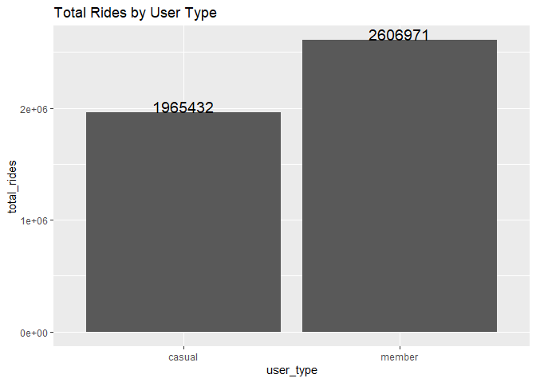<!-- -->
The total rides of casual is 1,965,432 and that of member is 2,606,971
\### Total rides by week_day

``` r
full_year %>% 
  group_by(day_of_week) %>% 
  summarise(number_of_rides = n())
```

    ## # A tibble: 7 × 2
    ##   day_of_week number_of_rides
    ##   <chr>                 <int>
    ## 1 Friday               652676
    ## 2 Monday               602041
    ## 3 Saturday             773994
    ## 4 Sunday               644301
    ## 5 Thursday             665908
    ## 6 Tuesday              606784
    ## 7 Wednesday            626699

``` r
full_year %>% 
  group_by(day_of_week) %>% 
  summarise(number_of_rides = n()) %>%
  ggplot(aes(x = reorder(day_of_week,-number_of_rides), y = number_of_rides, label = number_of_rides)) + 
  geom_bar(position = 'dodge', stat = 'identity')+
  geom_text(size = 4, position = position_dodge(width = .9), vjust =-0.5) +
  labs(title = 'Total rides by week_day', x='day_of_week', y = 'number_of_rides')
```

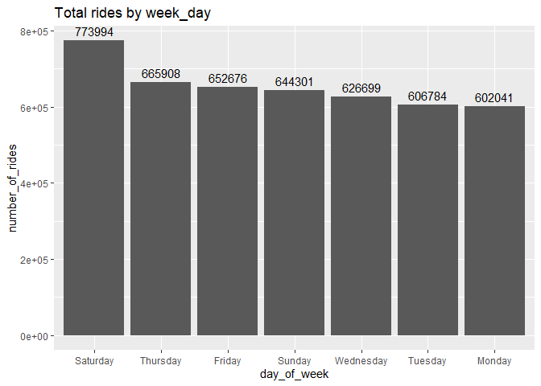<!-- -->
When we examine according to the days of the week, it has been observed
that most weekend driving takes place. It is assumed that the most
important reason for this is that the members prefer to tour by bike as
a weekend activity, since they have weekend holidays.

### Riding weekday by the Member Type

``` r
full_year %>% 
  group_by(day_of_week, member_casual) %>% 
  summarise(number_of_rides = n(), .groups = 'drop') %>%
  ggplot(aes(x = day_of_week, y=number_of_rides, fill = member_casual)) + 
  geom_bar(position = 'dodge', stat = 'identity')+
  #geom_text(size = 4, position = position_dodge(width = .9), vjust =-0.5) +
  labs(title = 'Riding weekday by the Member Type', x='day_of_week', y = 'number_of_rides')
```

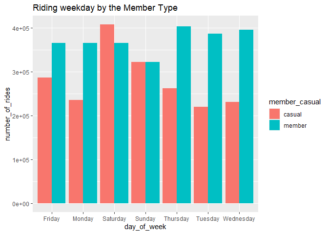<!-- -->
If we divide this analysis according to member types, it is observed
that casual members reach the highest number of rides on Saturdays,
while annual members reach the highest number of rides on Thursdays.
Annual members made more rides on all other days in total number of
rides except Saturday.

### Total Rides by per Bike Type

``` r
full_year %>% 
  group_by(member_casual, rideable_type) %>% 
  summarise(number_of_rides = n(), .groups = 'drop')
```

    ## # A tibble: 5 × 3
    ##   member_casual rideable_type number_of_rides
    ##   <chr>         <chr>                   <int>
    ## 1 casual        classic_bike           767814
    ## 2 casual        docked_bike            156602
    ## 3 casual        electric_bike         1041016
    ## 4 member        classic_bike          1336588
    ## 5 member        electric_bike         1270383

``` r
full_year %>% 
  group_by(member_casual, rideable_type) %>% 
  summarise(number_of_rides = n(), .groups = 'drop') %>%
  ggplot(aes(x = rideable_type, y = number_of_rides, label = number_of_rides, fill=member_casual)) +
  geom_bar(position = 'dodge', stat = 'identity') +
  geom_text(size = 3.5, position = position_dodge(width = .9), vjust = 0) +
  labs(title = 'Total Rides by per Bike Type', x = 'number of rides', y= 'rideable type')
```

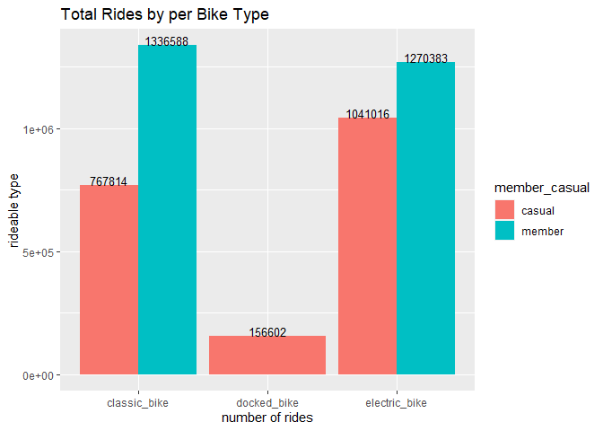<!-- -->
It was observed that casual members preferred the most electric bike
type with 1,041,016 rides, while annual members preferred the classic
bike type the most with 1,336,588 rides.

### Riding by the Hours

``` r
full_year %>%
  group_by(member_casual, hour) %>%
  summarise(total_ride = n(), .groups = 'drop') %>%
  ggplot(aes(x = hour, y = total_ride, color = member_casual)) +
  geom_line() +
  scale_x_continuous(breaks = seq(4,24, by=2))
```

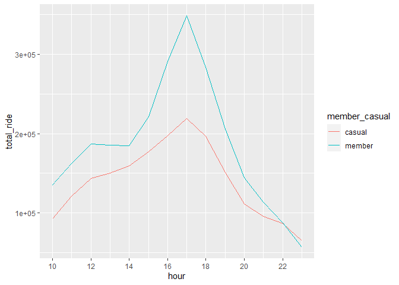<!-- -->

``` r
full_year %>%
  group_by(member_casual, hour) %>%
  summarise(total_ride = n(), .groups = 'drop') %>%
  ggplot(aes(x = hour, y = total_ride, fill = member_casual)) +
  geom_bar(stat = 'identity')
```

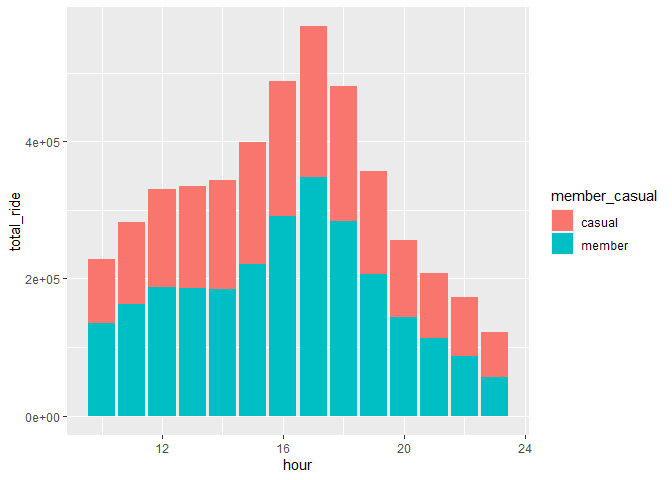<!-- -->
When the number of driving hours of the day according to the user type
is examined, it is clearly seen that the annual and casual members drive
more especially in the afternoon and evening hours.

### Riding by time of the day

``` r
full_year %>%
  group_by(member_casual, time_of_day)%>%
  summarise(total_rides = n(), .groups = 'drop') %>%
  ggplot(aes(x = time_of_day, y = total_rides, fill = member_casual, label=total_rides)) +
  geom_bar(position = 'dodge', stat = 'identity') +
  geom_text(size = 3, position = position_dodge(width = .9), vjust=-0.5) +
  labs(title = 'riding by time_of_day', x = 'time_of_day', y='total_rides')
```

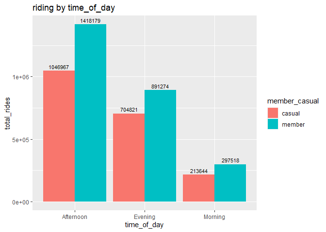<!-- -->
The driving behaviors of the users in certain time periods of the day
were examined. According to these reviews, it has been observed that
annual and casual members have a higher driving percentage in the
Afternoon compared to other time periods. While the evening time period
has the second highest percentage of driving, the least driving occurred
at morning.

### number of rides by months

``` r
full_year %>%
  group_by(member_casual, month_name) %>%
  summarise(total_rides = n(), .groups = 'drop') %>%
  ggplot(aes(x = reorder(month_name, -total_rides),  y = total_rides, fill=member_casual)) +
  geom_bar(position = 'dodge', stat = 'identity') +
  #geom_text(size = 3, position = position_dodge(width = .9), vjust=0) +
  labs(title = 'number of rides by months', x = 'month', y='number of rides') +
  theme(axis.text.x = element_text(angle = 45, vjust=1, hjust =1))
```

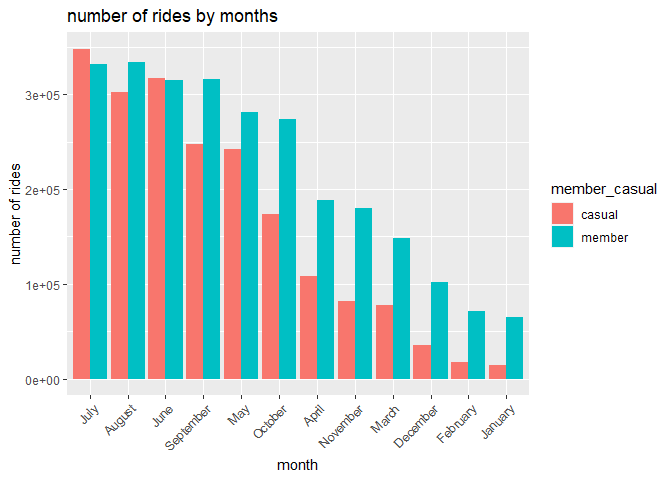<!-- -->
When we group our total number of rides by months, we observe that the
highest number of rides occurs in july. Again, August and June were
observed as the months with the most driving. It was clearly seen that
December, January and February had the lowest driving percentages. \###
number of rides per season

``` r
full_year %>%
  group_by(member_casual, season) %>%
  summarise(total_rides = n(), .groups = 'drop') %>%
  ggplot(aes(x = season, y = total_rides, label = total_rides, fill=member_casual)) +
  geom_bar(position = 'dodge', stat = 'identity') +
  geom_text(size = 3, position = position_dodge(width = .9), vjust=0) +
  labs(title = 'number of rides per season', x = 'season', y='number of rides')
```

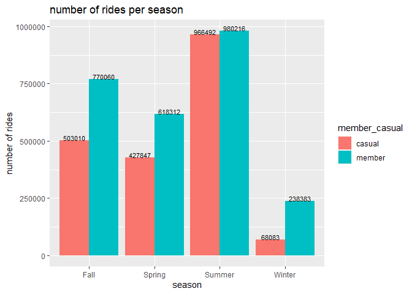<!-- -->

``` r
  #theme(axis.text.x = element_text(angle = 45, vjust=1, hjust =1))
```

Both the casual and member user_type drive most in the summer season.

``` r
full_year%>%
  group_by(season, day_of_week, member_casual) %>%   
  summarise(number_of_rides = n()                        
  ,avg_ride_length = mean(ride_length), .groups = 'drop') %>% 
  ggplot(aes(x = day_of_week, y = avg_ride_length,fill=member_casual)) +
  geom_bar(position = 'dodge', stat = 'identity') +
  #geom_text(size = 3, position = position_dodge(width = .9), vjust=0) +
  facet_wrap(~season) + 
  scale_y_continuous(breaks = seq(0, 50, by = 10)) +
  labs(title = 'ride_lenght by week_day', x = 'day_of_week', y='avg_ride_length') +
  theme(axis.text.x = element_text(angle = 45, vjust=1, hjust =1))
```

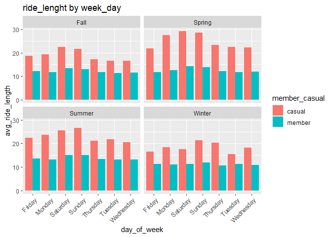<!-- -->

``` r
#ggplot() + geom_bar(mapping = aes(x = day_of_week, y = avg_ride_length, fill = member_casual), #position = "dodge") + facet_wrap(~season) + scale_y_continuous(breaks = seq(0, 50, by = 10))
```

demonstrates that the member group has all year long the average ride
length of about 13.6 minutes. Casual riders use bikes about half an hour
long on all days in spring and summer. In winter and fall, the average
ride lengths becomes less than 30 minutes.

``` r
full_year%>%
  group_by(season, day_of_week, member_casual) %>%   
  summarise(number_of_rides = n()                        
  ,avg_ride_length = mean(ride_length), .groups = 'drop') %>% 
  ggplot(aes(x = day_of_week, y = number_of_rides, fill=member_casual)) +
  geom_bar(position = 'dodge', stat = 'identity') +
  #geom_text(size = 3, position = position_dodge(width = .9), vjust=0) +
  facet_wrap(~season) + 
  scale_y_continuous(breaks = seq(0, 400000, by = 50000)) +
  labs(title = 'number of rides by week_day', x = 'day_of_week', y='number_of_rides') +
  theme(axis.text.x = element_text(angle = 45, vjust=1, hjust =1))
```

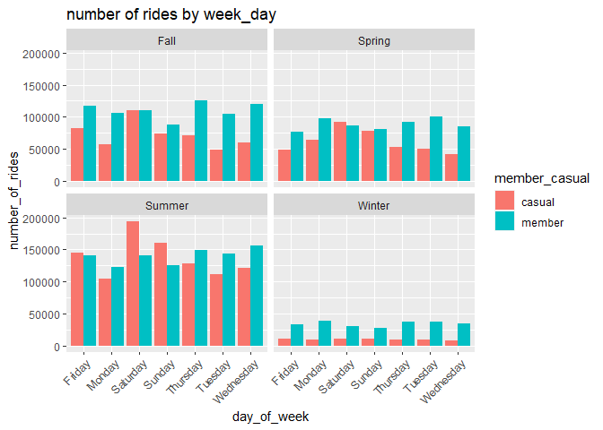<!-- -->

``` r
#ggplot() + geom_col(mapping = aes(x = day_of_week, y = number_of_rides, fill = member_casual), #position = "dodge") + facet_wrap(~season) + scale_y_continuous(breaks = seq(0, 400000, by = 50000))
```

tells us that number of rides of members is always higher than that of
casual riders on every work day in every season. Weekends are still the
time where casual riders bike more than members. The only exception of
this trend is in the winter months (Dec, Jan, Feb).

``` r
full_year %>%
  group_by(member_casual, month) %>%
  summarise(total_ride = n(),
            avg_ride_length = mean(ride_length), .groups = 'drop') %>%
  ggplot(aes(x = month, y = total_ride, color = member_casual)) +
  geom_line() +
  scale_x_continuous(breaks = seq(1,12, by=2))+
  labs(title = 'number of rides along the whole year')
```

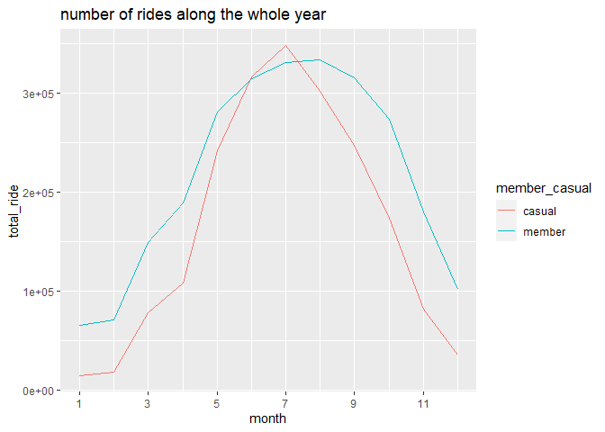<!-- -->
The plot indicates, for casual riders/members, ridership peaked around
July/August (Summer months being the turning point) and hit the lowest
at February before rebounding up swiftly and continuously.
